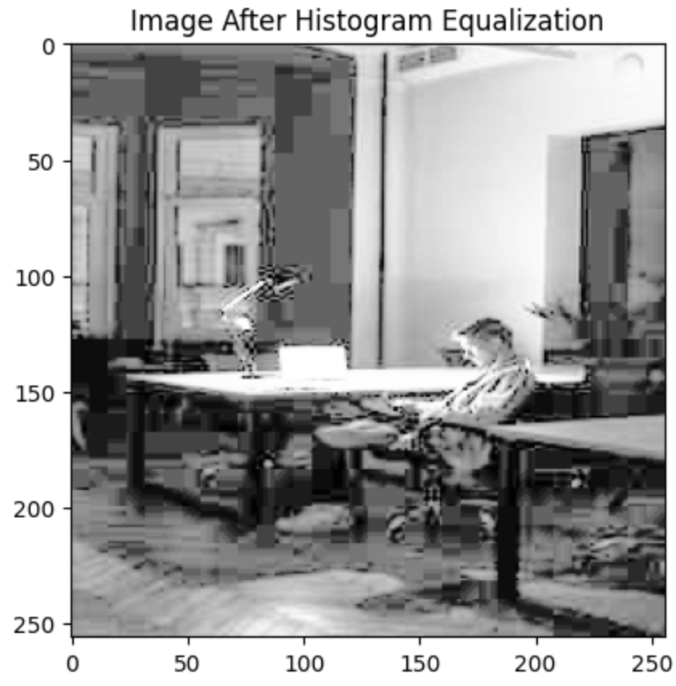
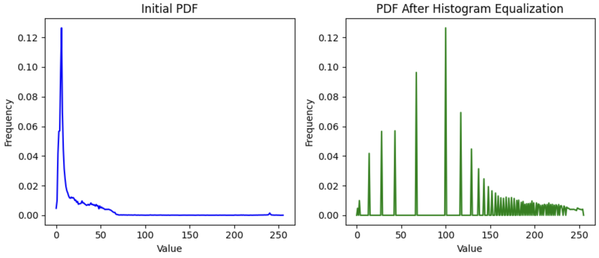
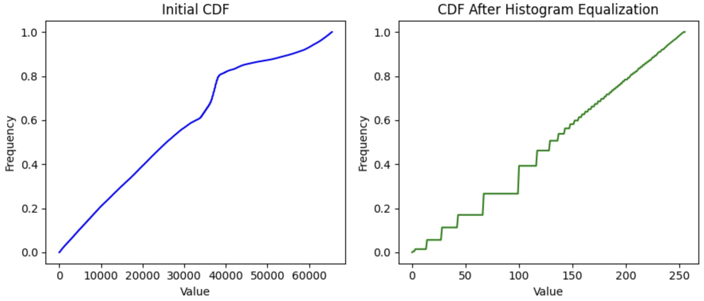

# Histogram Equalization for Image Contrast Enhancement

This project implements **Histogram Equalization** from scratch to enhance the contrast of a grayscale image. The goal is to redistribute the intensity values to stretch the dynamic range, revealing more visual details in low-contrast images.

---

## Steps Implemented

### 1. **Load and Convert Image**
- The image is read and converted to grayscale.
- Converted to a NumPy array for processing.

### 2. **Compute the Histogram**
- Counts how many pixels have each intensity value (0–255).
- Used to visualize the original contrast distribution.

### 3. **Compute PDF and CDF**
- **PDF**: Probability of each intensity level.
- **CDF**: Cumulative distribution used for remapping pixel values.
- The CDF is scaled and normalized to match the full range of 0–255.

```python
cdf = hist.cumsum()
cdf_normalized = cdf / cdf[-1]
new_img = (cdf_normalized[img.flatten()] * 255).astype(np.uint8).reshape(img.shape)
```

### 4. **Apply Histogram Equalization**
- Each pixel’s intensity is remapped using the scaled CDF.
- The output image has increased contrast with improved visual detail.

---

## Input vs Output

Below is a side-by-side comparison of the **original low-contrast image** and the **equalized result**:

<p float="left">
  
  
</p>

---

## PDFs and CDFs Before and After

We visualize the image statistics before and after histogram equalization using:

- **PDFs** (Probability Density Functions) for normalized intensity frequency  
- **CDFs** (Cumulative Distribution Functions) to show cumulative brightness coverage

After equalization, the intensity values are redistributed more evenly, resulting in improved contrast and dynamic range.

**PDF before and after histogram equalization**



**CDF before and after histogram equalization**



---

